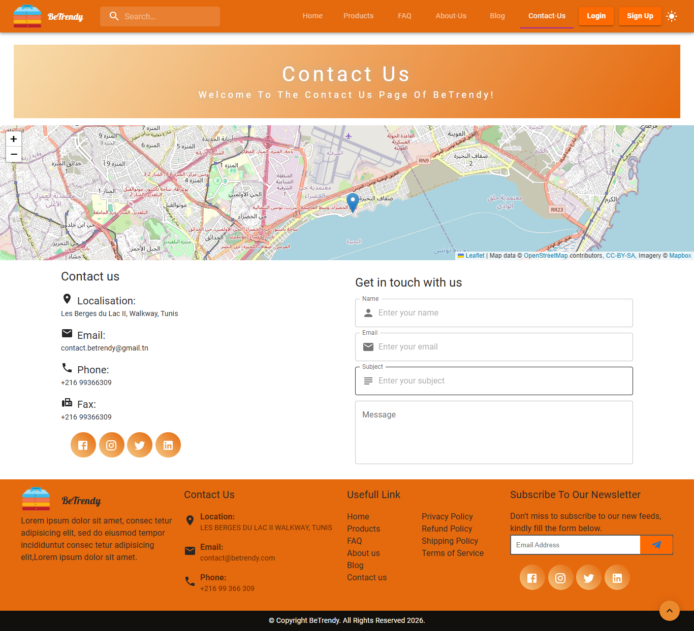

# Be-Trendy - E-commerce Website


**Live Demo:** [https://rihabcherni.github.io/be-trendy/](https://rihabcherni.github.io/be-trendy/)

Be-Trendy is a modern e-commerce web application built with **React.js** and **Material-UI**. It allows users to browse trendy products, add items to the cart, and complete purchases in a **responsive and interactive interface**.

---

## Features

* Browse trending products with images, prices, and descriptions
* Add items to cart and manage quantities
* Responsive design for desktop, tablet, and mobile
* Interactive UI with carousels and animations
* SweetAlert notifications for user actions
* React Router for smooth navigation
* Styled Components and Material-UI for design consistency

---

## Technologies Used

* **Frontend:** React 18, Material-UI, Sass, Styled Components
* **State Management & HTTP:** Axios
* **Routing:** React Router
* **UI Enhancements:** React Material-UI Carousel, React Multi-Carousel
* **Alerts:** SweetAlert
* **Deployment:** GitHub Pages

---

## Installation

1. Clone the repository:

   ```bash
   git clone https://github.com/rihabcherni/be-trendy.git
   cd be-trendy
   ````

2. Install dependencies:

   ```bash
   npm install
   ```

3. Start the development server:

   ```bash
   npm start
   ```

4. Open your browser at [http://localhost:3000](http://localhost:3000)

---

## Deployment

The project is deployed on **GitHub Pages**:
[https://rihabcherni.github.io/be-trendy/](https://rihabcherni.github.io/be-trendy/)

---

## Screenshots

### Newsletter Section


### Home Pages


### Contact Page



### FAQ Page


### Login Page


---

## Project Structure

```
be-trendy/
│
├─ public/
├─ src/
│  ├─ components/
│  ├─ pages/
│  ├─ assets/
│  ├─ App.js
│  └─ index.js
├─ package.json
└─ README.md
```

---

## Notes

* The app is fully responsive and optimized for mobile and desktop.
* UI interactions and carousels provide a smooth shopping experience.
* Can be extended with backend APIs for full e-commerce functionality.
::contentReference[oaicite:0]{index=0}
```
